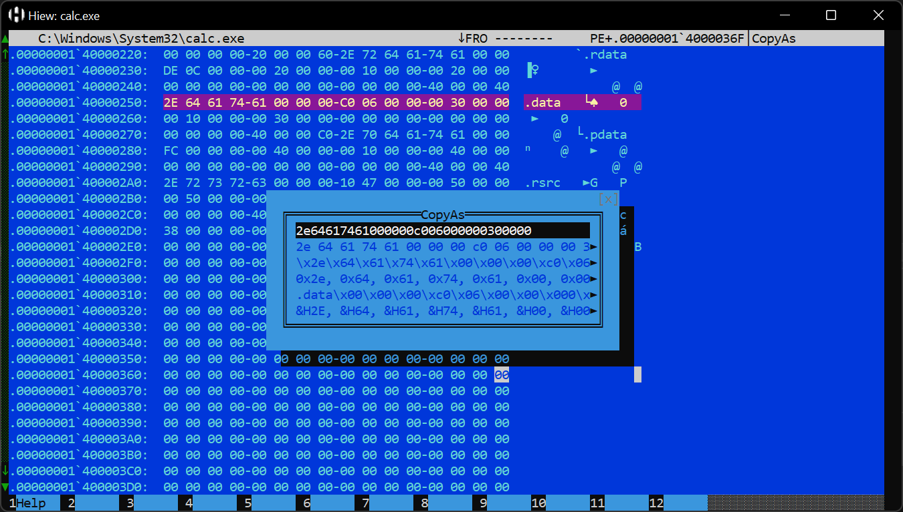

# CopyAs

[Hiew](https://hiew.io) External Module (HEM) to copy block data in different formats.

## Installation

Download the `.hem` file and put it in your Hiew `hem` folder.

## Usage

After opening a file in Hiew, mark a block, press `F11` to load a Hiew module and choose it from the menu.
The marked block data will be shown in different formats. Press `ENTER` to copy a string to clipboard and close
the window.

### Example

## Author

Fernando Mercês - https://x.com/@mer0x36
